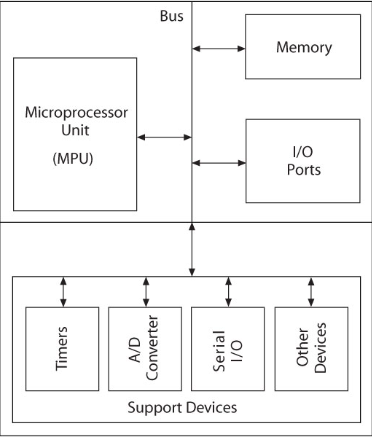
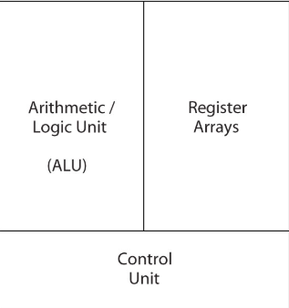
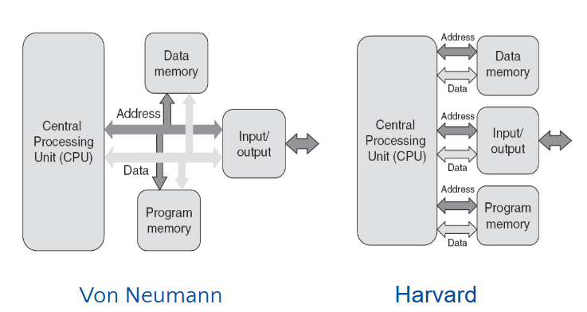
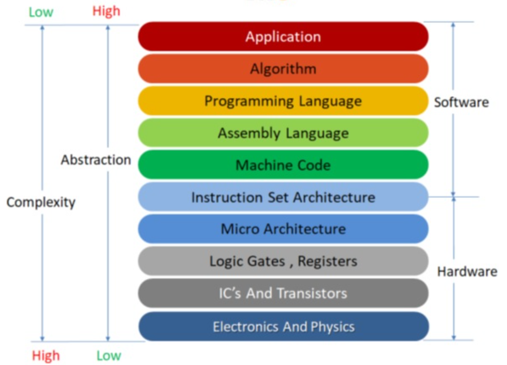

# Embedded Systems and Embedded software development

---

## 1. Embedded System Introduction

### 1.1. Definition
An embedded system is a computer system with a dedicated function within a larger mechanical or electrical system, often with real-time computing constraints. It is embedded as part of a complete device often including hardware and mechanical parts.

---

### 1.2. Application Area
- **Signal Processing:** Radar, Sonar, video compression  
- **Communication & Network:** Telephone system, router  
- **General Computing:** Video games, set-top boxes, wearable computer  
- **Control System:** Vehicle engine, nuclear power, fight control  

---

### 1.3. Features
- Embedded system is designed to perform some specific tasks.  
- The program written for embedded system is called **firm-ware**, and usually stored in persistence memory (rom/flash).  
- The firm-ware can run with limited hardware resourced.  

---

## 2. Microcontroller & Microprocessor

### 2.1. Difference between Microcontroller & Microprocessor

- The microprocessor is a processor on one silicon chip.  
- The microcontrollers are used in embedded computing.  
- The microcontroller is a microprocessor with added circuitry.  

---

### 2.2. Microcontroller overview

MCU is integrated electronic computing device that includes three major components on a single chip:
+ Microprocessor  
+ Memory  
+ I/O ports

---

### 2.3. Microprocessor overview

The microprocessor is a multipurpose, programmable device that accepts digital data as input, processes it according to instructions stored in its memory, and provides results as output.

---

## 3. Processor Architecture

### 3.1. Microprocessor architecture

Communicates with Memory and I/O using the System Bus:

- **Address bus**  
  + Unidirectional  
  + Memory and I/O Addresses  

- **Data bus**  
  + Bidirectional  
  + Transfers Binary Data and Instructions  

- **Control lines**  
  + Read and Write timing signals  

---

### 3.2. Von-neumann architecture and Harvard

---

## 4. Instruction Set Architecture (ISA)

### 4.1. Definition
ISA is the part of the computer architecture related to programming, including the native data types, instructions, registers, addressing modes, memory architecture, interrupt and exception handling, and external I/O.

---

### 4.2. Comparison between CISC & RISC

---
