# Universal Asynchronous Receiver-Transmitter (UART)

## 1. Overview of peripheral UART

### 1.1. Definition
A universal asynchronous receiver-transmitter is a peripheral device for asynchronous serial communication. It sends data bits one by one, from the least to most significant, framed by start and stop bits so that precise timing is handled by the communication channel.

### 1.2. Advantage and Disadvantage

#### 1.2.1. Advantage
- Single wire for each direction (plus ground wire)
- Asynchronous because no clock signal is transmit
- Relatively simple hardware
- Very widely used

#### 1.2.2. Disadvantage
- Low speed

### 1.3. UART application
- Become much less common
- Largely been replaced by faster, more sophisticated interfaces  
  + PCs: USB(peripherals), Internet(Network)  
  + Chip to chip: I2C, SPI
- Still use today when simple low speed communication is needed: for debugger

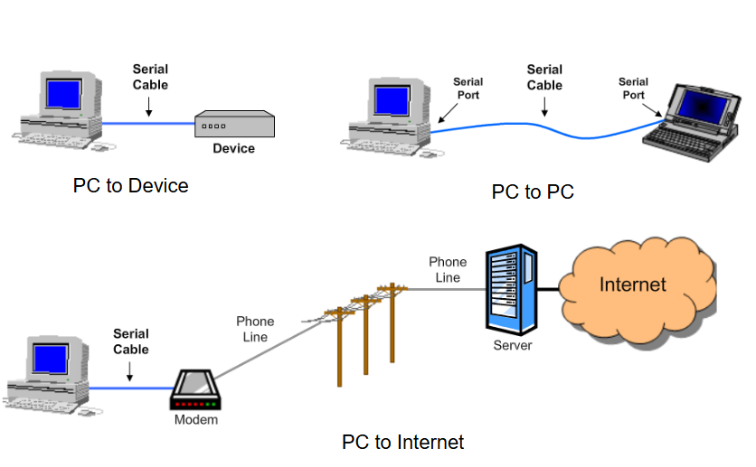

### 1.4. UART function
- **Transmitter**
  + Convert from parallel to serial  
  + Add Start and Stop bits  
  + Add parity bit  
- **Receiver**
  + Convert from serial to parallel  
  + Remove Start and Stop bits  
  + Check and remove parity bit  

---

## 2. Data transmission
- Use a single wire for transmission
- Each bit has fixed time duration determined by the transmission rate.  
  Example: a 1200 bps (bit per second) UART will have a 1/1200 s or about 833.3 µs bit duration.

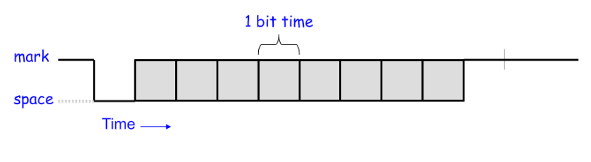

- The Start bit marks the beginning of a new transmission.
- When detected, the receiver synchronizes with the new data stream.

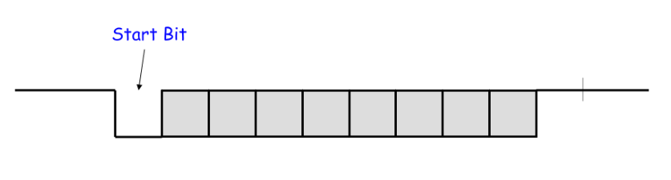

- Next follow the data bits (7 or 8).
- The least significant bit is sent first.

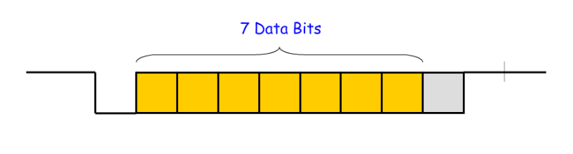

- The parity bit is added to make the number of 1’s even (even parity) or odd (odd parity).
- This can be used by the receiver to check for transmission errors.
- Use of parity bit is optional.

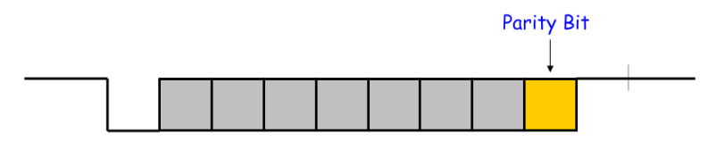

- The Stop bit marks the end of transmission.
- Receiver checks to make sure it is “1”.
- Separates one word from the start bit of the next word.

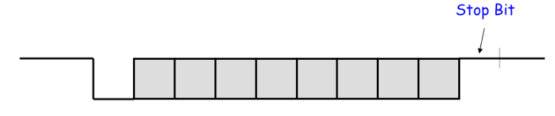

- In the configuration shown below, it takes 10 bits to send 7 bits of data.
- Transmission efficiency is 70%.

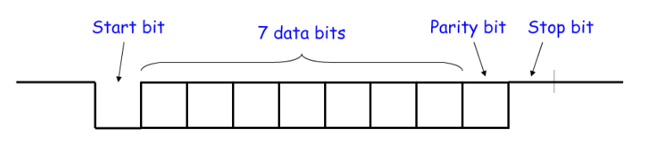

- An example of sending the ASCII letter “W” - 1010111

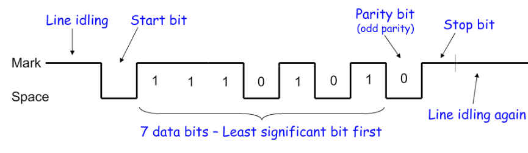

---

## 3. Data reception
- Receiver also verifies that stop bit is “1”, if not, reports “framing error” to host system.
- New start bit can appear immediately after Stop bit.
- Receiver will resynchronize for each Start bit.

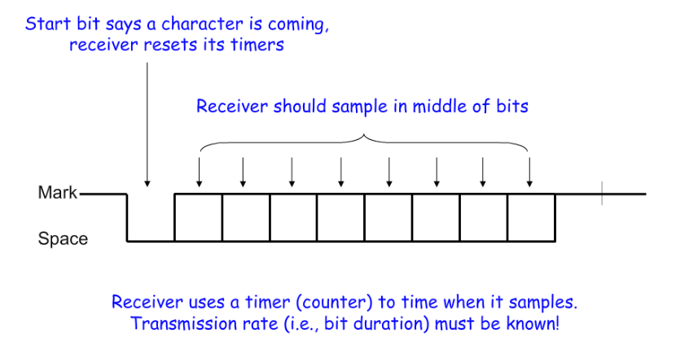

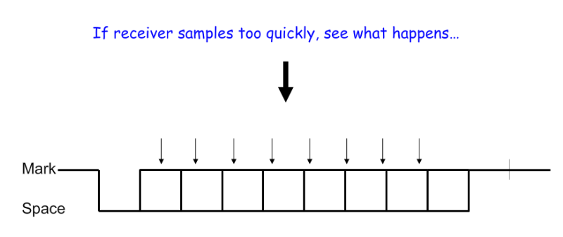

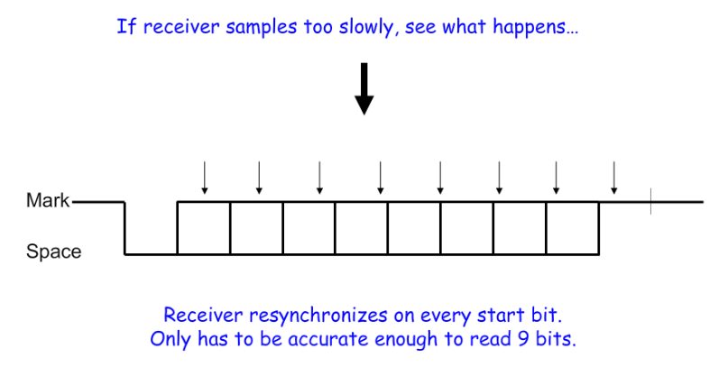

---

## 4. UART Option
UARTs usually have programmable options:
  + Data: 7 or 8 bits  
  + Parity: even, odd, none, mark, space  
  + Stop bits: 1, 1.5, 2  
  + Baud rate: 300, 1200, 2400, 4800, 9600, 19.2k, 38.4k, 57.6k, 115.2k…

---

## 5. UART Data throughput
Data throughput Example:  
Assume **19200 baud**, 8 data bits, no parity, 1 stop bit

- 19200 baud → 19.2 kbps  
- 1 start bit + 8 data bits + 1 stop bit = 10 bits → It takes 10 bits to send 8 bits of data  
- 19.2 kbps × 8/10 = **15.36 kbps**

Convert to KB/s:
- 15.36 kbps × (1 KB / 8192 bits) = **1.875 KB/s**
